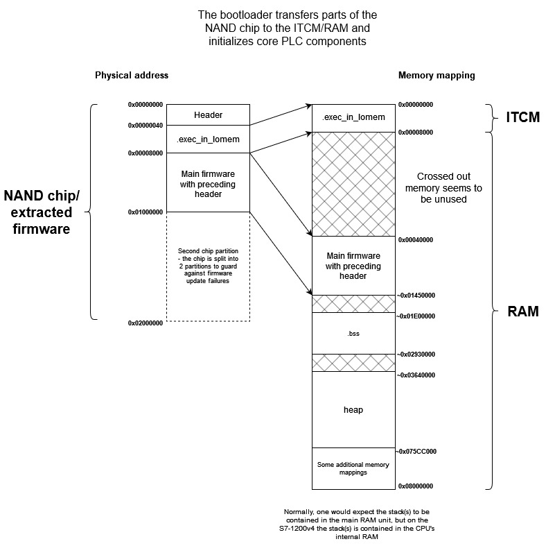

===========
PROJECT README
===========

This is a fork of Xilinx's QEMU fork, used for running experiments on
Siemens PLC firmware in an emulated environment. This work was done as part
of a master's thesis project at the University of Zagreb, Faculty of Electrical Engineering and Computing,
under the mentorship of Stjepan Groš, doc. dr. sc.

This repository builds on the fork by adding custom QEMU devices that the Siemens S7-1200 PLC communicates
with via its firmware and bootloader. The code which implements these devices can be found `here <https://github.com/Xilinx/qemu/compare/master...apantina:qemu:master>`_.

Please note that this repository is published solely for educational purposes and is by no means a finished
product.

Setup
============

First, build QEMU locally using the below specified target and params.
This will build QEMU for ARM architecture which is required for
emulation of Siemens' S7-1200 PLC.

.. code-block::

  mkdir build
  cd build
  ../configure --target-list="aarch64-softmmu" --enable-fdt --disable-kvm --disable-xen --enable-gcrypt֒
  make -j$(nproc)

After building QEMU, there are some prerequisites that need to be completed for successful emulation
of the PLC's firmware.

First, it is required to get the bootloader of the PLC itself. This can be quite tricky, but doable using a
device such as `Bus Pirate <http://dangerousprototypes.com/docs/Bus_Pirate>`_ and an appropriate chip programming software, e.g. `flashrom <https://www.flashrom.org/Bus_Pirate>`_. Since flashrom doesn’t include support for the S7-1200 bootloader chip, one needs to modify the code to include it. It is recommended to first just add the chip ID in the flashchips.h file so the chip is recognized. Once that is done, one only needs to copy a similar chip’s configuration and add an entry in the flaschips.c file. Lastly, a very specific modification needs to be made. The parameter chunk_size in the spi_read_chunked function needs to be changed to the constant 256. Once this is done, one can connect Bus Pirate to the chip and read the contents using flashrom. 

.. code-block::

sudo ./flashrom -p buspirate_spi:dev=/dev/ttyUSB0,spispeed=1M --read bootloader.bin --chip <CHIP_NAME>

The argument dev should be the USB port on which Bus Pirate is connected to the PC. If something goes wrong, the argument -VVV can be added to get a detailed overview of what happened

Once the bootloader has been acquired it is also required to get a binary of the firmware which will run on the
emulated PLC. This can be done by `decompressing <https://gitlab.com/lgrguric/siemens_lzp3>`_ the firmware update files available on Siemens' official website. The firmware update file includes multiple compressed sections, and the section marked with A0000 is the one that contains the compressed firmware binary blob. 
After the firmware update file has been decompressed (that is, the section marked with A0000), the resulting firmware needs to be rearranged. 

On the actual PLC, its bootloader has the role of copying the firmware from the NAND chip on the PLC to RAM and ITCM.  The contents of the firmware on the NAND chip can be separated into 3 distinct areas - the first 0x40 bytes containing the header with firmware metadata, the following 0x8000 bytes which make up the .exec_in_lomem section, and the rest of the firmware the size of which varies, but is around 0x01100000 bytes. From these 3 areas, only the latter 2 will be copied to RAM and ITCM. For emulation purposes, RAM and ITCM can be understood to be one and the same and shall be collectively referred to as simply RAM. The following image shows how the bootloader copies the contents of the chip to RAM.

    
We need to emulate this (that is, copying the firmware to RAM) behavior. To do this, one needs to separate the different parts of the firmware update file - throw out the first 0x40 bytes (the header), save the next 0x8000 bytes in one file (exec_in_lomem), and finally save the rest in another file (main_firmware). The exec_in_lomem section is manually copied over a part of the bootloader code at address 0x0 once the bootloader itself is finished with its execution. The main_firmware section, which contains most of the firmware logic, is loaded to address 0x40000 using QEMU’s device loader.

This exec_in_lomem copying is emulated using a separate QEMU device, in `this file <https://github.com/apantina/qemu/blob/master/hw/misc/plc_80280000.c>`_.
The driver responsible for copying requires the path to be specified in the `EXEC_IN_LOMEM_FILENAME` identifier.

Also, the endianness of both the bootloader and the firmware binaries (and the EXEC_IN_LOMEM file which is referenced later in this guide) needs to be flipped from big-endian to little-endian. This is necessary because the PLC is run in big-endian mode which is not supported by our QEMU machine. 
Flipping the endianness is quite straightforward, and the authors of this doc used `this simple open-source tool <https://github.com/rgrahamh/byte-swapper>`_.
After cloning the project and compiling it, it’s as easy as running `./byte_swap file.bin 32` (32-byte swap), where the file.bin file is your extracted bootloader or firmware binary. While not tested, it is presumed that swapping bytes will cause problems for some parts of the emulated firmware, e.g. where the data size is not 4 bytes.
Additionally, the bootloader’s `setend be`assembly instruction, which sets the CPU’s endianness, needs to be changed to either `nop` or `setend le`. The simplest way to do this is to change the instruction on the location 0x1b8 (this location may vary from version to version) of the bootloader’s binary from `f1 01 02 00` to `00 00 00 00` (basically no-op) using your favorite hex editor. 

Finally, a device tree binary is required. The one which was used in the below example is included in the root of this fork,
under the filename `board-zynqmp-zcu1285.dtb`. You can also compile this device tree binary
via instructions in `this repository <https://github.com/Xilinx/qemu-devicetrees>`_, after applying the changes from
`this gist <https://gist.github.com/apantina/38d22d43e35c2abaa69651435a6d63d6>`_.

.. code-block::

  ./build/aarch64-softmmu/qemu-system-aarch64 \
  -M arm-generic-fdt \
  -serial mon:stdio \
  -device loader,
  file=<path to stripped firmware file>,addr=0x40000,
  cpu-num=4,force-raw=true \
  -device loader,
  file=<path to PLC bootloader binary>,addr=0x0
  -device loader,addr=0XFF5E023C,data=0x80088fde,data-len=4 \
  -device loader,addr=0xff9a0000,data=0x80000218,data-len=4 \
  -hw-dtb <path to device tree binary> \
  -m 4G -singlestep -d in_asm,nochain -s

Full example:

.. code-block::

  ./build/aarch64-softmmu/qemu-system-aarch64 \
  -M arm-generic-fdt \
  -serial mon:stdio \
  -device loader,
  file=../../firmware-images/fw.stripped.rev,addr=0x40000,
  cpu-num=4,force-raw=true \
  -device loader,
  file=../../bootloader_images/Siemens_1211Cv4_bootloader.bin,addr=0x0
  -device loader,addr=0XFF5E023C,data=0x80088fde,data-len=4 \
  -device loader,addr=0xff9a0000,data=0x80000218,data-len=4 \
  -hw-dtb ./board-zynqmp-zcu1285.dtb \
  -m 4G -singlestep -d in_asm,nochain -s > log.txt

Note that the output of this command is is redirected to a `log.txt` file for easier navigation and searching
after execution has finished. The output should show ARM assembly instructions of the PLC's bootloader and firmware
being executed on the QEMU-emulated machine.

===========
QEMU README
===========

QEMU is a generic and open source machine & userspace emulator and
virtualizer.

QEMU is capable of emulating a complete machine in software without any
need for hardware virtualization support. By using dynamic translation,
it achieves very good performance. QEMU can also integrate with the Xen
and KVM hypervisors to provide emulated hardware while allowing the
hypervisor to manage the CPU. With hypervisor support, QEMU can achieve
near native performance for CPUs. When QEMU emulates CPUs directly it is
capable of running operating systems made for one machine (e.g. an ARMv7
board) on a different machine (e.g. an x86_64 PC board).

QEMU is also capable of providing userspace API virtualization for Linux
and BSD kernel interfaces. This allows binaries compiled against one
architecture ABI (e.g. the Linux PPC64 ABI) to be run on a host using a
different architecture ABI (e.g. the Linux x86_64 ABI). This does not
involve any hardware emulation, simply CPU and syscall emulation.

QEMU aims to fit into a variety of use cases. It can be invoked directly
by users wishing to have full control over its behaviour and settings.
It also aims to facilitate integration into higher level management
layers, by providing a stable command line interface and monitor API.
It is commonly invoked indirectly via the libvirt library when using
open source applications such as oVirt, OpenStack and virt-manager.

QEMU as a whole is released under the GNU General Public License,
version 2. For full licensing details, consult the LICENSE file.

Documentation
=============

Documentation can be found hosted online at
`<https://www.qemu.org/documentation/>`_. The documentation for the
current development version that is available at
`<https://www.qemu.org/docs/master/>`_ is generated from the ``docs/``
folder in the source tree, and is built by `Sphinx
<https://www.sphinx-doc.org/en/master/>_`.

Building
========

QEMU is multi-platform software intended to be buildable on all modern
Linux platforms, OS-X, Win32 (via the Mingw64 toolchain) and a variety
of other UNIX targets. The simple steps to build QEMU are:

.. code-block:: shell

  mkdir build
  cd build
  ../configure
  make

Additional information can also be found online via the QEMU website:

* `<https://qemu.org/Hosts/Linux>`_
* `<https://qemu.org/Hosts/Mac>`_
* `<https://qemu.org/Hosts/W32>`_

Submitting patches
==================

The QEMU source code is maintained under the GIT version control system.

.. code-block:: shell

   git clone https://gitlab.com/qemu-project/qemu.git

When submitting patches, one common approach is to use 'git
format-patch' and/or 'git send-email' to format & send the mail to the
qemu-devel@nongnu.org mailing list. All patches submitted must contain
a 'Signed-off-by' line from the author. Patches should follow the
guidelines set out in the `style section
<https://www.qemu.org/docs/master/devel/style.html>` of
the Developers Guide.

Additional information on submitting patches can be found online via
the QEMU website

* `<https://qemu.org/Contribute/SubmitAPatch>`_
* `<https://qemu.org/Contribute/TrivialPatches>`_

The QEMU website is also maintained under source control.

.. code-block:: shell

  git clone https://gitlab.com/qemu-project/qemu-web.git

* `<https://www.qemu.org/2017/02/04/the-new-qemu-website-is-up/>`_

A 'git-publish' utility was created to make above process less
cumbersome, and is highly recommended for making regular contributions,
or even just for sending consecutive patch series revisions. It also
requires a working 'git send-email' setup, and by default doesn't
automate everything, so you may want to go through the above steps
manually for once.

For installation instructions, please go to

*  `<https://github.com/stefanha/git-publish>`_

The workflow with 'git-publish' is:

.. code-block:: shell

  $ git checkout master -b my-feature
  $ # work on new commits, add your 'Signed-off-by' lines to each
  $ git publish

Your patch series will be sent and tagged as my-feature-v1 if you need to refer
back to it in the future.

Sending v2:

.. code-block:: shell

  $ git checkout my-feature # same topic branch
  $ # making changes to the commits (using 'git rebase', for example)
  $ git publish

Your patch series will be sent with 'v2' tag in the subject and the git tip
will be tagged as my-feature-v2.

Bug reporting
=============

The QEMU project uses GitLab issues to track bugs. Bugs
found when running code built from QEMU git or upstream released sources
should be reported via:

* `<https://gitlab.com/qemu-project/qemu/-/issues>`_

If using QEMU via an operating system vendor pre-built binary package, it
is preferable to report bugs to the vendor's own bug tracker first. If
the bug is also known to affect latest upstream code, it can also be
reported via GitLab.

For additional information on bug reporting consult:

* `<https://qemu.org/Contribute/ReportABug>`_

ChangeLog
=========

For version history and release notes, please visit
`<https://wiki.qemu.org/ChangeLog/>`_ or look at the git history for
more detailed information.

Contact
=======

The QEMU community can be contacted in a number of ways, with the two
main methods being email and IRC

* `<mailto:qemu-devel@nongnu.org>`_
* `<https://lists.nongnu.org/mailman/listinfo/qemu-devel>`_
* #qemu on irc.oftc.net

Information on additional methods of contacting the community can be
found online via the QEMU website:

* `<https://qemu.org/Contribute/StartHere>`_
